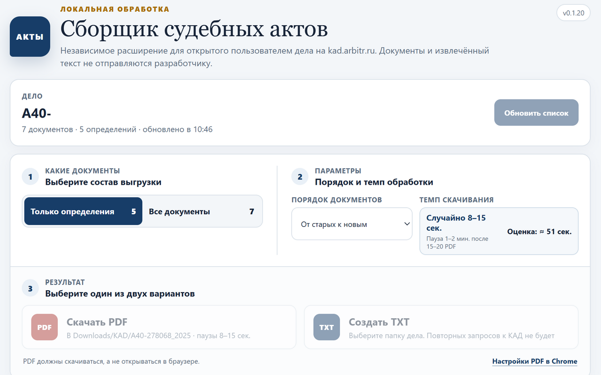

<p align="center">
  
</p>

<h1 align="center">Сборщик судебных актов</h1>

<p align="center">
  Расширение Chrome для сохранения PDF и локального извлечения текста<br>
  из документов открытого дела на <code>kad.arbitr.ru</code>
</p>

<p align="center">
  
  
  
  
</p>

---



## Что делает расширение

- получает список документов из карточки дела, открытой пользователем;
- позволяет выбрать отдельные документы или весь доступный список;
- последовательно сохраняет PDF с понятными именами;
- локально извлекает текст посредством PDF.js;
- формирует единый TXT с датами, типами документов и ссылками на оригиналы;
- останавливает очередь при ограничении доступа со стороны сайта.

Документы, извлечённый текст и сведения о делах не передаются разработчику или сторонним сервисам. У расширения нет собственного сервера, аналитики и рекламы.

## Быстрая установка

1. Скачайте [`KAD_Act_Collector_v0.1.20.zip`]([https://github.com/vsi52/kad-act-collector/releases/download/v0.1.20/KAD_Act_Collector_v0.1.20.zip]).
2. Распакуйте архив в отдельную папку.
3. Откройте в Chrome страницу `chrome://extensions`.
4. Включите **Режим разработчика**.
5. Нажмите **Загрузить распакованное расширение** и выберите созданную папку.

> Для стабильного сохранения файлов рекомендуется включить скачивание PDF вместо открытия в браузере: `chrome://settings/content/pdfDocuments`.

## Как пользоваться

1. Откройте карточку нужного дела на `kad.arbitr.ru`.
2. Нажмите **Собрать судебные акты** на странице или значок расширения.
3. При первом запуске прочитайте и примите пользовательское соглашение.
4. Выберите документы, порядок и формат результата: PDF или единый TXT.
5. Не закрывайте исходную вкладку до завершения операции.

## Конфиденциальность

Вся обработка выполняется локально в браузере. Chrome обращается непосредственно к `kad.arbitr.ru` в рамках текущей пользовательской сессии.

| Принцип | Реализация |
|---|---|
| Передача данных | Данные не отправляются разработчику и сторонним сервисам |
| Обработка PDF | Локально, посредством включённой в сборку PDF.js |
| Запуск операций | Только по явной команде пользователя |
| Доступ к сайтам | Ограничен адресом `https://kad.arbitr.ru/*` |
| Удалённый код | Не используется |

- [Политика конфиденциальности](PRIVACY.md)
- [Пользовательское соглашение](TERMS.md)
- [Сторонние компоненты](THIRD_PARTY_NOTICES.md)

## Ограничения

Расширение не предназначено для массового копирования базы КАД, не обходит CAPTCHA, блокировки и другие ограничения доступа. Доступ к документу не означает права на его публичное распространение. Достоверность извлечённого текста следует проверять по исходному PDF.

Расширение является независимым продуктом и не связано с `kad.arbitr.ru`, АО «ПравоТех», арбитражными судами или иными государственными органами.

## Сборка из исходников

Требуются Node.js 20 или новее и npm:

```bash
npm ci
npm run build
npm run check
```

Собранное расширение появится в каталоге `dist`. Команда `npm run package` дополнительно создаёт установочный и исходный ZIP в каталоге `release`.

## Поддержка и безопасность

Об ошибках сообщайте через раздел [Issues](https://github.com/vsi52/kad-act-collector/issues). Укажите версии Chrome и расширения, приложите обезличенный скриншот или журнал.

Не публикуйте cookies, токены, пароли, полные HAR-файлы и документы ограниченного доступа. Подробности приведены в [SECURITY.md](SECURITY.md).

## Автор и лицензия

Разработчик: **Sergei I Vybornov**

Собственный код проекта распространяется по лицензии [MIT](LICENSE). PDF.js используется по Apache License 2.0. Полные тексты лицензий зависимостей находятся в каталоге [`licenses`](licenses).

Copyright © 2026 Sergei I Vybornov.
